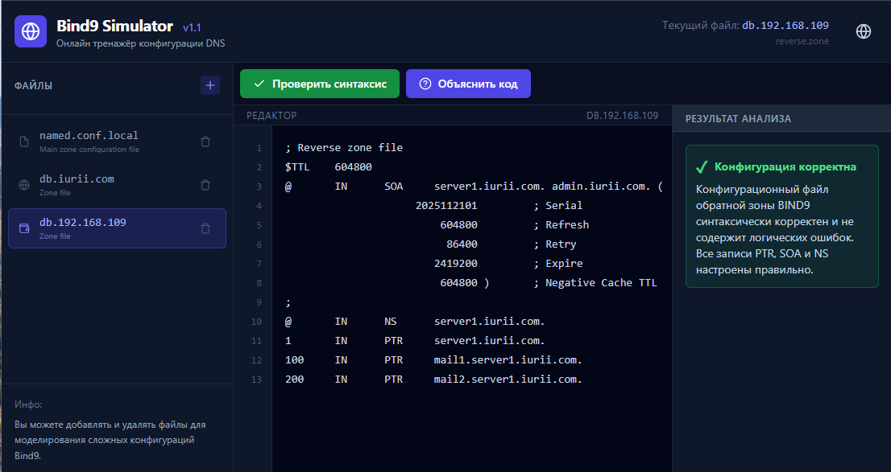

# BIND9 Simulator

This is a web-based application that simulates the configuration of a BIND9 DNS server. 


It provides a user-friendly interface to create, edit, and validate BIND9 configuration files. 


The application leverages the Google Gemini API to provide intelligent feedback, including syntax validation and explanations of configuration files.

## Features

*   **File Management:** Easily create, edit, and delete BIND9 configuration files (e.g., `named.conf`, zone files).
*   **Syntax Validation:** Get instant feedback on your BIND9 configuration. The application uses an AI-powered service to check for syntax and logical errors.
*   **Configuration Explanation:** Understand what your BIND9 configuration does with clear and concise explanations generated by an AI.
*   **Multi-language Support:** The user interface and AI-generated responses are available in English, Spanish, and Russian.

## Tech Stack

*   **Frontend:** React, TypeScript, Vite
*   **AI:** Google Gemini API
*   **UI:** Custom components for a code editor, file tabs, and an output console.

## Getting Started

### Prerequisites

*   Node.js installed on your machine.
*   A Google Gemini API key.

### Installation & Setup

1.  **Clone the repository:**
    ```bash
    git clone <repository-url>
    cd bind9-simulator
    ```

2.  **Install dependencies:**
    ```bash
    npm install
    ```

3.  **Set up your environment variables:**
    Create a `.env.local` file in the root of the project and add your Google Gemini API key:
    ```
    API_KEY=your-gemini-api-key
    ```

4.  **Run the application:**
    ```bash
    npm run dev
    ```
    The application will be available at `http://localhost:5173` (or another port if 5173 is in use).
